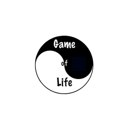

# GameOfLife 
Simulation of Conway's game of life with cocos2d-x c++ 

## About the project 
This simulation was made with the cocos2d-x c++ engine. It simulates the Conway's game of life with three different grid sizes and with variable render speed.
The main purpose of the simulation was to practice and lear the basics of the cocos engine to be able to do some other and more complex projects with it in the future.
The code basically extends the main classes of the engine adding them new properties and functionality.

[Download for Android](https://play.google.com/store/apps/details?id=com.MrBlissfulGrin.GameOfLife "Game of Life Android app")

Project done by Juan Casado Ballesteros

[Mr.BlissfulGrin](http://www.mrblissfulgrin.com "mrblissfulgrin")

[Cocos2d-x c++ game engine](http://www.cocos2d-x.org "Cocos2d-x c++ game engine")

